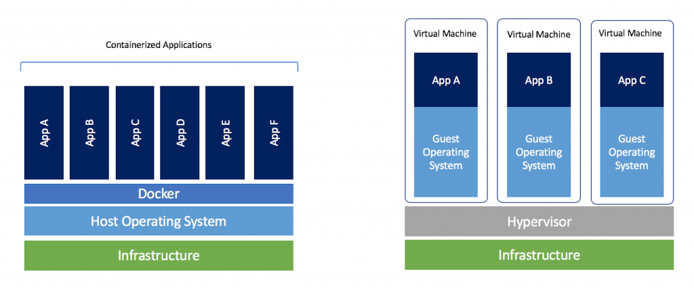

<!-- <b>Last modified: <script>document.write( document.lastModified );</script> -->

### Why docker?



Docker is a useful tool which allows us to run the code in a contained environment that is **isolated** from the rest of the system. This can be particularly useful when working with deep learning frameworks, which can be difficult to install and configure. By using Docker, we can **easily switch** between different versions of a deep learning framework, or between different libraries or packages, or between different OS version, without affecting the rest of the system. Additionally, Docker can be used to **package** up ythe code and dependencies into a single container, which can be easily shared with others or deployed to a cloud environment. In short, Docker is a containerization solution that lets us **"build, run and share applications with containers"**.
- Multiple CUDA versions: [virtualenv](https://maiminh1996.github.io/distilled/cuda/installing-cuda.html#multi-cuda-version-on-the-one-machine) --> docker containers
- Different OSs: launch a Docker container with Ubuntu 20.04 while the host machine is running Ubuntu 16.04 and vice versa.
- Easily deploy the container to cloud providers (such as AWS, Google Cloud, Azure etc.).


### Quick example

#### Context

We want to run [PointRCNN](https://github.com/sshaoshuai/PointRCNN) by using docker. By default, the author proposes this requirement:
- Ubuntu 16.04 (gcc 5.4.0)
- python 3.6+
- pytorch 1.0

As expected we will build a docker image like mine [mnaminh1996/pointrcnn](https://hub.docker.com/r/mnaminh1996/pointrcnn). From there, we can launch the docker container to run [PointRCNN](https://github.com/sshaoshuai/PointRCNN) on. The steps that we need to do are as follows:

Host machine (my machine) description: 
- `cat /etc/os-release`: Ubuntu 18.04
- `nvcc -V`: CUDA 11.0 (FYI: nvcc is CUDA compiler driver included in CUDA toolkit)
- `cd /usr/local/cuda/samples/1_Utilities/deviceQuery && sudo make && ./deviceQuery | grep Capability`: GeForce RTX 2070 (capability 7.5 - Turing) --> supported by CUDA 10.2 (FYI: we refer the NVIDIA CUDA Toolkit documentation to determine which GPU architectures (compute capacity) are supported by a specific version of CUDA).
- `ubuntu-drivers devices`
- `lscpu`, `lshw`, `lsblk`

#### Build docker image
> Build docker image on host machine

We set up for PointRCNN, dataset, etc following <https://github.com/sshaoshuai/PointRCNN.git>.
```bash
git clone --recursive https://github.com/sshaoshuai/PointRCNN.git
```

Download KITTI dataset and put it somewhere like this:
```bash
$ tree
data
├── KITTI
│   ├── ImageSets
│   ├── object
│   │   ├──training
│   │      ├──calib & velodyne & label_2 & image_2 & (optional: planes)
│   │   ├──testing
│   │      ├──calib & velodyne & image_2
```
Download the [pretrained weight](https://drive.google.com/file/d/1aapMXBkSn5c5hNTDdRNI74Ptxfny7PuC/view) proposed by PointRCNN author.

```bash
cd PointRCNN
echo "tqdm
fire
scikit-image
numba
easydict
numpy
scipy
scikit-learn
PyYAML==5.1.2
h5py
tensorboardX
torch==1.0.1
setuptools
protobuf" > requirements.txt
```

We then create a Dockerfile based on this docker image [nvidia/cuda:10.2-cudnn8-devel-ubuntu16.04](https://registry.hub.docker.com/layers/nvidia/cuda/10.2-cudnn8-devel-ubuntu16.04/images/sha256-f32cdb7cfbd4fb047fe6580333ffd20204fdedc28742fa044885651d5af190f6?context=explore). But first we need to install Docker + NVIDIA Container Toolkit on the host machine, refer [Pre-requirement](#pre-requirement).
```Dockerfile
FROM nvidia/cuda:10.2-cudnn8-devel-ubuntu16.04

ENV TZ=Europe/Minsk
RUN ln -snf /usr/share/zoneinfo/$TZ /etc/localtime && echo $TZ > /etc/timezone

# Install basic dependencies
RUN apt-get update && apt-get install -y --no-install-recommends \
    apt-utils \
    build-essential \
    cmake \
    git \
    wget \
    libatlas-base-dev \
    libboost-all-dev \
    libgflags-dev \
    libgoogle-glog-dev \
    libhdf5-serial-dev \
    libleveldb-dev \
    liblmdb-dev \
    libopencv-dev \
    libprotobuf-dev \
    libsnappy-dev \
    protobuf-compiler \
    python3-dev \
    python3-pip \
    python3-setuptools \
    python3-tk \
    python3-wheel

RUN apt-get install -y --no-install-recommends \
    libssl-dev libncurses5-dev libsqlite3-dev \
    libreadline-dev libtk8.6 libgdm-dev \
    libdb4o-cil-dev libpcap-dev

# on ubuntu16.04, python3.5 is default
# RUN apt-get update && \
#     apt-get install -y software-properties-common && \
#     add-apt-repository ppa:deadsnakes/ppa
# RUN apt-get update && apt-get install -y python3.6
RUN apt-get update && \
    apt-get install -y build-essential && \
    wget https://www.python.org/ftp/python/3.6.10/Python-3.6.10.tgz && \
    tar xzf Python-3.6.10.tgz && \
    cd Python-3.6.10 && \
    ./configure && \
    make && \
    make install

RUN rm /usr/bin/python
RUN ln -s /usr/local/bin/python3 /usr/bin/python

WORKDIR /home

# Install Python dependencies
COPY requirements.txt .

RUN apt-get update && apt-get install --reinstall ca-certificates
RUN python3 -m pip install --upgrade pip setuptools wheel
RUN python3 -m pip install --no-cache-dir opencv-python
RUN python3 -m pip install -r requirements.txt
```

Build docker image:
```bash
docker build -t <name-build-image:name-tag> .
```

Check if docker image built successfully:
```bash
docker images
# REPOSITORY  TAG     IMAGE ID      CREATED       SIZE
# pointrcnn   latest  dde823c6de1d  23 hthes ago  8.21GB
```

Run a container on host machine with `--gpus all` to enable gpus into container. We can blind-mount datas `-v /path-to-data-in-host/:/path-to-data-in-container/` to use in container:
```bash
# Run a docker container in interactive mode based on the docker image above
# and blind-mount code, dataset, weight, etc
docker run --gpus all -v /home/maiminh/PointRCNN/:/home/PointRCNN/ \
  -v /home/maiminh/KITTI_data/:/home/PointRCNN/data/ \
  -v /home/maiminh/PointRCNN.pth:/home/PointRCNN/PointRCNN.pth \
  -it pointrcnn

# Install pakages and run an example following 
# https://github.com/sshaoshuai/PointRCNN
cd PointRCNN
sh build_and_install.sh
cd tools
python eval_rcnn.py --cfg_file cfgs/default.yaml \
  --ckpt ../PointRCNN.pth --batch_size 1 \
  --eval_mode rcnn --set RPN.LOC_XZ_FINE False
```

#### Share docker image

Create a account on [docker hub](https://hub.docker.com/) and share the above built docker image:
```bash
# Login with Docker ID (from docker hub)
docker login
# push the image into Docker Hub.
docker tag pointrcnn mnaminh1996/pointrcnn:latest
docker push mnaminh1996/pointrcnn:latest
```

#### Run docker container
> Run docker container on the target machine

Pull docker image and run a docker container on the target machine. Similarly, we have to install Docker + NVIDIA Container Toolkit on the target machine, refer [Pre-requirement](#pre-requirement).
```bash
# Pull the docker image from docker hub
docker pull mnaminh1996/pointrcnn:latest
# Run a docker container in interactive mode based on the docker image above
# and blind-mount code, dataset, weight, etc
docker run --gpus all -v /home/maiminh1996/PointRCNN/:/home/PointRCNN/ \
  -v /home/KITTI/data/:/home/PointRCNN/data/ \
  -v /home/maiminh1996/PointRCNN/PointRCNN.pth:/home/PointRCNN/PointRCNN.pth \
  -it mnaminh1996/pointrcnn:latest

# Install pakages and run an example following 
# https://github.com/sshaoshuai/PointRCNN
cd PointRCNN
sh build_and_install.sh
cd tools
python eval_rcnn.py --cfg_file cfgs/default.yaml \
  --ckpt ../PointRCNN.pth --batch_size 1 \
  --eval_mode rcnn --set RPN.LOC_XZ_FINE False
```

### Pre-requirement

#### Docker

Install Docker on the host machine and also on the target machine if it is not already installed [https://docs.docker.com/engine/install/](https://docs.docker.com/engine/install/).
```bash
# Update the package index and install the required packages
sudo apt-get update && \
  sudo apt-get install apt-transport-https ca-certificates \
  curl gnupg-agent software-properties-common
# Add the GPG key for the Docker repository
curl -fsSL https://download.docker.com/linux/ubuntu/gpg | \
  sudo apt-key add -
# Add the Docker repository to ythe system's software stheces
sudo add-apt-repository \
  "deb [arch=amd64] https://download.docker.com/linux/ubuntu $(lsb_release -cs) stable"
# Update the package manager's package list and install docker
sudo apt-get update && \
  sudo apt-get install docker-ce docker-ce-cli containerd.io
# Verify that Docker is installed correctly by running the following command
sudo docker run hello-world
```

#### NVIDIA Container Toolkit

Install the NVIDIA Container Toolkit on the host machine [https://github.com/NVIDIA/nvidia-docker](https://github.com/NVIDIA/nvidia-docker). This will allow you to run GPU-accelerated Docker containers.
```bash
# Add the GPG key for the NVIDIA Container Toolkit package repository
curl -s -L https://nvidia.github.io/nvidia-docker/gpgkey | \
  sudo apt-key add -
# Add the package repository to ythe list of stheces
distribution=$(. /etc/os-release;echo $ID$VERSION_ID)
curl -s -L https://nvidia.github.io/nvidia-docker/$distribution/nvidia-docker.list | \
  sudo tee /etc/apt/stheces.list.d/nvidia-docker.list
# Install the `nvidia-docker2` package
sudo apt-get update && \
  sudo apt-get install -y nvidia-docker2
# Restart the Docker daemon
sudo pkill -SIGHUP dockerd
```

<!-- [docker](https://docs.docker.com/engine/install/), docker-compose, and Nvidia CUDA installed on ythe host system -->

### Dockerfile

Some keywords: `FROM`, `ENV`, `RUN`, `WORKDIR`, `COPY`, `CMD`. For the complet list, refer to <https://docs.docker.com/engine/reference/builder/>.

Pre-designed images:
- <https://hub.docker.com/>
- <https://registry.hub.docker.com/r/nvidia/cuda/tags>
- <https://hub.docker.com/r/pytorch/pytorch/tags?page=1>

### Docker image

> docker image contains set of cmd and metadata. If Docker image was like a class, docker container is an instance

Build a docker image
```bash
docker build -t <name-build-image> . # . where it contains Dockerfile
```

List, tag remove images
```bash
# Show images
docker images # list all images
# docker image ls

# show the history of an image
docker history <image-id>

# set image name from image-id
docker tag <image-id> <image-names> 

# remove docker image
# may need to resolve conflict with dependency container 
docker rmi <image-id> 
# docker image rm <image-id>
```

### Docker container

> each container is an instance of un image.

Run a container (it actually creates a new container based on the specified image). We can use VS Code --> Activity bar --> Docker to modify code, manage docker images/ container/ ...
```bash
# show all images
docker images

# create a new container
# run a container in interactive mode (-it), built-image: image id/ name
docker run -it <built-image> 

# list all containers
docker ps # all running containers
# docker ps -a # all containers (including stopped)
```

Stop, restart a container
```bash
# stop
docker stop <container-id> 
# docker rm <container-id>

# restart an existing container after it exited and the changes are still there.
docker start <container-id> # restart it in the background
docker attach <container-id> # reattach the terminal & stdin
```

Commit a container (intead of working on old container, we can save container changes into new image).
```bash
docker commit <container-id> <new-image-name>
```

Copy datas from container
```bash
# copy data from a container to local machine
docker cp <container-id>:app/epoch50.pth /path/
```

blind-mount data
```bash
# dataset stored in the /data directory on ythe host machine, 
# and you want to mount this directory into a Docker container at /app/data. 
docker run -v /data:/app/data -it <image_name>
```

### Save docker image

#### Save in file .tar
<!-- https://dockerlabs.collabnix.com/beginners/saving-images-as-tar/ -->
Save the docker image in `.tar`:
```bash
docker save -o <built-image.tar> <built-image>
```
Or export a docker container in `.tar`:
```bash
docker export <container-id> > <container-name.tar>
```

#### Push on docker hub
```bash
docker login
docker tag <local-image:tagname> <new-repo:tagname>
docker push <new-repo:tagname>
```

<!-- Phương thức 	Mô tả
Docker commands / "By hand" 	Tạo 1 container với docker run và input. Tạo 1 image qua docker commit .
Dockerfile 	Xây dựng từ 1 image cơ bản, với build xác định cùng với số lượng command nhất định (recommend) .
Dockerfile và configuration management (CM) tool 	Giống Dockerfile, nhưng kiểm soát để build thêm qua cộng cụ CM tool .
Scratch image và import 1 vài file 	Từ 1 image rỗng, import 1 tar file với 1 vài file bắt buộc .


https://blog.roboflow.com/nvidia-docker-vscode-pytorch/ -->


<!-- ```dockerfile
FROM nvidia/cuda:11.0.3-cudnn8-devel-ubuntu18.04

# The submission directory contains the code and associated libraries that are
# clonein future steps.
RUN mkdir -p /code/submission
WORKDIR /code/submission

# Get packages needed for builds below.
RUN apt-get update \
  && apt-get install -y wget unzip g++ git libgl1-mesa-glx \
                        libboost-all-dev llvm-10 libsm6 libxrender-dev \
  && rm -rf /var/lib/apt/lists/*

RUN apt update && \
    apt install --no-install-recommends -y build-essential python3 python3-pip && \
    apt clean && rm -rf /var/lib/apt/lists/*

RUN apt-get update \
  && apt-get install -y python3-pip

# Install the specific version of PyTorch recommended for the libraries below.
RUN python3 -m pip install --upgrade pip \
  && python3 -m pip install torch==1.7.1+cu110 torchvision==0.8.2+cu110 -f https://download.pytorch.org/whl/torch_stable.html

# CMake is required for builds.
RUN wget https://github.com/Kitware/CMake/releases/download/v3.19.4/cmake-3.19.4-Linux-x86_64.tar.gz \
  && tar xf cmake-3.19.4-Linux-x86_64.tar.gz \
  && rm -f cmake-3.19.4-Linux-x86_64.tar.gz

ENV CUDA_TOOLKIT_ROOT_DIR=/usr/local/cuda-11.0 \
    PATH=$PATH:/code/submission/cmake-3.19.4-Linux-x86_64/bin/ \
    LLVM_CONFIG=/usr/bin/llvm-config-10 \
    PYTHONPATH=/code/submission/lib:$PYTHONPATH \
    TF_CPP_MIN_LOG_LEVEL=1 \
    CUDA_HOME=/usr/local/cuda-11.0

# Install dependency.
RUN git clone --recursive https://github.com/traveller59/spconv.git \
  && cd spconv \
  && python3 setup.py bdist_wheel \
  && cd dist \
  && python3 -m pip install *

RUN git clone https://github.com/NVIDIA/apex \
  && cd apex \
  && git checkout 5633f6  \
  && python3 -m pip install -v --no-cache-dir --global-option="--cpp_ext" --global-option="--cuda_ext" ./

COPY ./vinDet3D-CenterBased ./vinDet3D-CenterBased

ENV PYTHONPATH="${PYTHONPATH}:/code/submission/vinDet3D-CenterBased"

RUN cd vinDet3D-CenterBased \
  && python3 -m pip install -r requirements.txt \
  && bash setup.sh

# Python should default to python3 for this code.
RUN update-alternatives --install /usr/bin/python python /usr/bin/python3 0

# Copy in the folder with the submission module and download the model weights
# from https://github.com/open-mmlab/OpenPCDet/blob/master/README.md.
COPY lib /code/submission/lib

COPY ./epoch_26.pth /code/submission/lib/wod_latency_submission/WAYMO_MODEL_WEIGHTS.pth

# Set the working directly correctly so to ensure access to some config files.
WORKDIR /code/submission/vinDet3D-CenterBased
``` -->


<!-- ### Debug -->
<!-- Why need debugging https://www.quora.com/Why-do-you-need-to-debug-when-writing-code

https://python.plainenglish.io/debugging-deep-learning-docker-containers-3815a44c9519

https://medium.com/@adityathiruvengadam/cuda-docker-%EF%B8%8F-for-deep-learning-cab7c2be67f9 -->

### References
1. <https://maiminh1996.github.io/distilled/cuda/installing-cuda.html#multi-cuda-version-on-the-one-machine>
2. <https://hub.docker.com/r/mnaminh1996/pointrcnn>
3. <https://registry.hub.docker.com/layers/nvidia/cuda/10.2-cudnn8-devel-ubuntu16.04/images/sha256-f32cdb7cfbd4fb047fe6580333ffd20204fdedc28742fa044885651d5af190f6?context=explore>
4. <https://github.com/sshaoshuai/PointRCNN.git>
5. <https://docs.docker.com/engine/install/>
6. <https://github.com/NVIDIA/nvidia-docker>
7. <https://docs.docker.com/engine/reference/builder/>
8. <https://hub.docker.com/>
9. <https://registry.hub.docker.com/r/nvidia/cuda/tags>
10. <https://hub.docker.com/r/pytorch/pytorch/tags?page=1>
