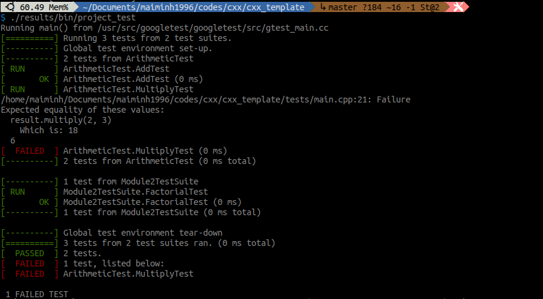
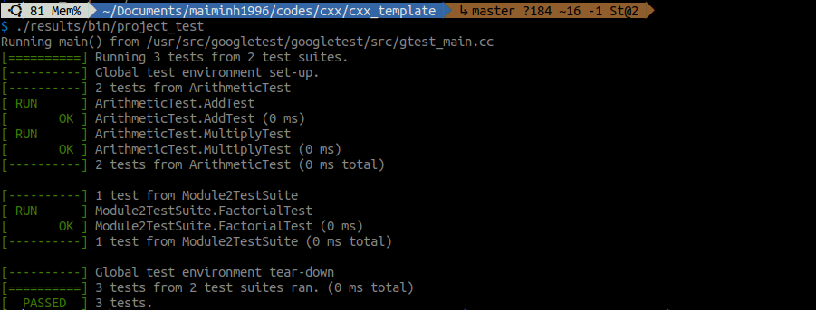

### Introduction

Unit testing is an essential practice in software development that helps ensure the correctness and reliability of individual units or components of code. In C++, one popular unit testing framework is Google Test, also known as GTest. In this blog post, we will explore how to set up and use GTest for writing unit tests in C++.

### Simple gtest example

Let's begin by examining the project structure required to integrate GTest into a C++ project. Here's an example project structure:

```bash
$ tree
.
# ├── build/
├── CMakeLists.txt
├── include/
│   └── mymath/
│       ├── module1.h
│       └── module2.h
# ├── results/
# │   ├── bin/
# │   └── lib/
├── src/
│   ├── CMakeLists.txt
│   ├── main.cpp
│   └── mymath/
│       ├── module1.cpp
│       └── module1.cpp
└── tests/ # THIS IS WHERE WE WRITE OUR TESTS
│   ├── CMakeLists.txt
│   └── main.cpp
└── thirty_party/
```

```c++
// include/mymath/module1.h
#ifndef MODULE1_H
#define MODULE1_H

class Arithmetic {
public:
    int add(int a, int b);
    int multiply(int a, int b);
};

#endif
```
```c++
// src/mymath/module1.cpp
#include "module1.h"

int Arithmetic::add(int a, int b) {
    return a + b;
}

int Arithmetic::multiply(int a, int b) {
    return a * b * b; // TRY DOING STH WRONG HERE //
}
```
```c++
// include/mymath/module2.h
#ifndef MODULE2_H
#define MODULE2_H

// Function to calculate the factorial
unsigned long long factorial(unsigned int n);

#endif
```

```c++
// src/mymath/module2.cpp
#include "module2.h"

unsigned long long factorial(unsigned int n) {
    if (n == 0 || n == 1)
        return 1;
    else
        return n * factorial(n - 1);
}
```

```cmake
# CMakeLists.txt
cmake_minimum_required(VERSION 3.5)
project(project)

# Set flag C++ 11
set(CMAKE_CXX_STANDARD 11)

# Set outputs into a specific dir, e.g. 'bin'
set(CMAKE_RUNTIME_OUTPUT_DIRECTORY ${PROJECT_SOURCE_DIR}/results/bin)

add_subdirectory(src)

add_subdirectory(tests) # THIS IS WHERE WE BUILD OUR TESTS
```

Install `gtest`:
```bash
# Download gtest into /usr/src/gtest
sudo apt-get install libgtest-dev 
sudo apt-get install cmake
# Build gtest
cd /usr/src/gtest
sudo cmake CMakeLists.txt
sudo make
# Make the lib file accessible from a standard library search path
sudo ln -s /usr/src/gtest/lib/libgtest.a /usr/lib/libgtest.a
sudo ln -s /usr/src/gtest/lib/libgtest_main.a /usr/lib/libgtest_main.a
```

```cmake
# tests/CMakeLists.txt
# Import GTest
find_package(GTest REQUIRED)
if(GTest_FOUND)
    message(STATUS "GTest found: ${GTest_VERSION}")
else()
    message(FATAL_ERROR "GTest not found")
endif()

if(GTEST_LIBRARY)
    message(STATUS "GTEST_LIBRARY:" ${GTEST_LIBRARY})
    message(STATUS "GTEST_MAIN_LIBRARY: " ${GTEST_MAIN_LIBRARY})
else()
    set(GTEST_LIBRARY "/usr/lib/libgtest.a")
    set(GTEST_MAIN_LIBRARY "/usr/lib/libgtest_main.a")
endif()

# Collect .cpp test cases in tests and .cpp definition in srxc/mymath/
file(GLOB_RECURSE SOURCES "./*.cpp" 
                            "../src/mymath/*.cpp"
                            )
message(STATUS "SOURCES in tests is:" ${SOURCES})

# Add the executable "project_test"
add_executable(project_test ${SOURCES}) # include definition codes

# The target_link_libraries directive needs to be part of the same CMakeLists.txt as the add_executable directive.
target_link_libraries(project_test ${GTEST_LIBRARY} ${GTEST_MAIN_LIBRARY} pthread) 
# given header files
target_include_directories(project_test # target project_test from add_subdirectory(tests)
                            PRIVATE
                                ${PROJECT_SOURCE_DIR}/include/mymath
                                )
```

In order to create unit tests using `GTest`, we generate a `main.cpp` file within the tests directory. This process involves explicitly registering test cases and suites, typically achieved through the use of macros. In gtest, a test suite (`TestSuite`) is a collection of related test cases (`TestCase`), while a test case is an individual test scenario or unit of testing within a test suite. Below is an illustration of the `tests/main.cpp` file as an example:

```c++
// tests/main.cpp
#include <gtest/gtest.h>
#include "module1.h"
#include "module2.h"
 
// Define a test fixture for the Arithmetic class
class ArithmeticTest : public ::testing::Test {
protected:
    // Create an instance of the Arithmetic class
    Arithmetic result;
};

// TEST_F macro is used to define a test case within a test fixture
// Test case for the add method
TEST_F(ArithmeticTest, AddTest) {
    ASSERT_EQ(result.add(2, 3), 5);
}

// Test case for the multiply method
TEST_F(ArithmeticTest, MultiplyTest) {
    ASSERT_EQ(result.multiply(2, 3), 6);
    ASSERT_EQ(result.multiply(2, 0), 0);
    ASSERT_EQ(result.multiply(3, 10), 30);
}

// TEST macro is used to define a standalone test case without a test fixture
TEST(Module2TestSuite, FactorialTest){
    ASSERT_EQ(factorial(4), 24);
    ASSERT_EQ(factorial(0), 1);
}
```

Check [GTest Testing Reference](http://google.github.io/googletest/reference/testing.html) to see gtest syntax.


Build and run the tests:
```bash
mkdir build
cd build
cmake ..
make
cd .. && ./results/bin/project_test 
```




To address this, we make modifications to `src/module1.cpp`

```c++
// src/mymath/module1.cpp
#include "module1.h"

int Arithmetic::add(int a, int b) {
    return a + b;
}

int Arithmetic::multiply(int a, int b) {
    return a * b; // FIX IS HERE //
}
```

Build and test again:
```bash
cd build && make
cd .. && ./results/bin/project_test 
```



### Conclusion

Unit testing is crucial for ensuring the quality and correctness of software projects. Google Test (GTest) provides a powerful framework for writing unit tests in C++. In this blog post, we explored the setup process of GTest in a C++ project and wrote a simple unit test to verify the functionality of a basic function. By adopting unit testing practices with GTest, developers can increase code coverage and build more robust and reliable software.

### References

1. [GoogleTest User’s Guide](http://google.github.io/googletest/)

<!-- https://cppdeveloper.com/tutorial/unit-test-voi-google-test-gtest-tren-linux/ -->
<!-- ### Errors

[libIlmImf-2_2.so.22 not found](https://stackoverflow.com/questions/64738243/problem-with-imagemagick-after-upgrading-ubuntu-to-20-04)

```bash
cd /usr/lib/x86_64-linux-gnu 
sudo ln -s libIlmImf-2_3.so.24 libIlmImf-2_2.so.22
``` -->